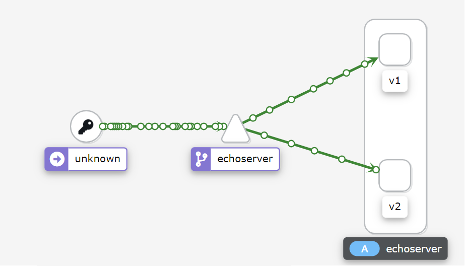

# Выпроленени домашено задачния : https://github.com/izhigalko/otus-homework-istio

В рамках задания было развернуто:
- istio
- jaeger
- kiali
- prometheus + grafana
- приложение из урока (echoserver) в 2-х версиях
- было сделано разделение трафика на 50% между версиями

Прикладываю снимок экрана с картой сервисов в Kiali с вызовом двух версий сервиса:
